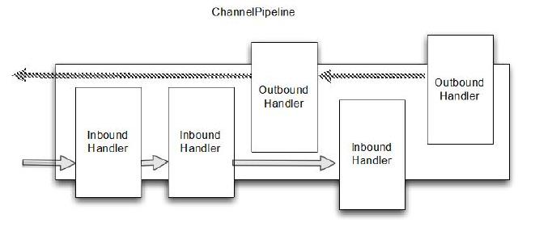

## ChannelPipeline
`ChannelPipeline` 是 `ChannelHandler` 键的容器
`ChannelPipeline` 是一系列 `ChannelHandler` 的实例，用于拦截一个 `Channel` 的入站和出站事件，`ChannelPipeline` 允许用户自定义入站\出站事件的处理逻辑。

每一次创建了新的Channel ,都会新建一个新的 ChannelPipeline并绑定到Channel上。这个关联是 永久性的;

下图展示了用于入站和出站 ChannelHandler 的 典型 ChannelPipeline 布局

## 